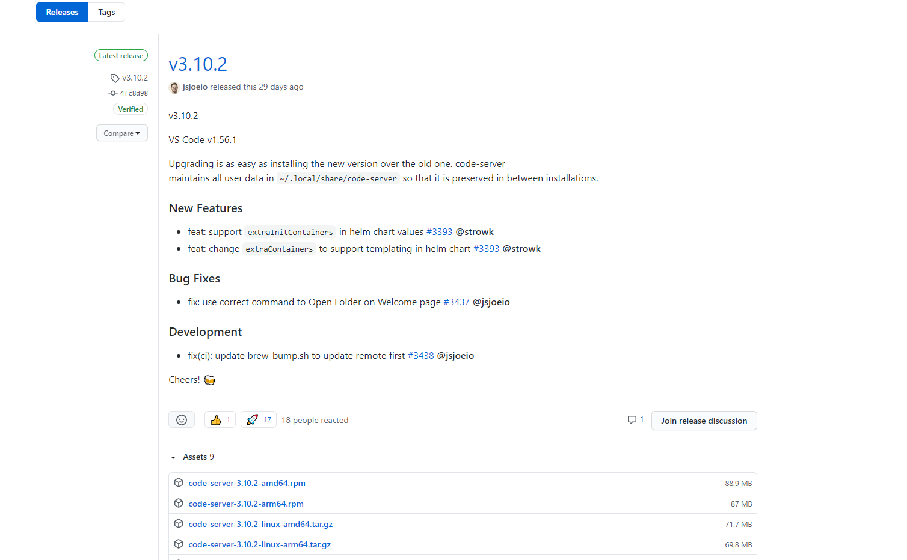
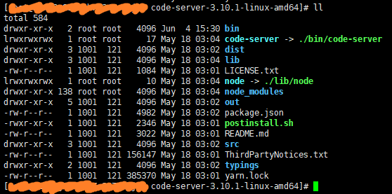
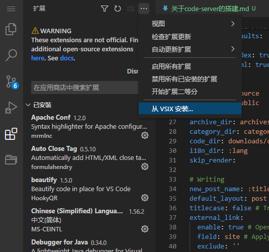

## 前言

code-server 是一个可以让用户在网页上使用 Vs Code 编程的服务，主要适用于特殊情况时移动设备上的开发，例如平板电脑、未安装编译器的笔记本等。这篇文章详细描述了我的搭建过程。

<!--more-->

正如它的[Github主页](https://github.com/cdr/code-server)介绍的一般，code-server 是可以一个在浏览器中运行 Vs Code 的服务。不过首先，你需要一台服务器。

官方推荐的服务器配置为 2 核 1G ，不过我的服务器是 1 核 2G 的，低强度使用下没有什么问题。另外，服务的部分功能需要 Https 连接才可以正常使用。

*（注：以下部分外链需要科学上网后才可以访问）*

## 安装

进入 Github 中的[下载地址](https://github.com/cdr/code-server/releases)，有不同版本可供选择下载。我的服务器上安装的版本为 code-server-3.10.1-linux-amd64 ，大家可根据自身服务器自行选择。



以 3.10.1-linux-amd64 版本为例，在服务器中键入以下命令下载和解压压缩包。

```
#下载压缩包
wget https://github.com/cdr/code-server/releases/download/v3.10.1/code-server-3.10.1-linux-amd64.tar.gz
#解压
tar -zvxf code-server-3.10.1-linux-amd64.tar.gz
```

解压完成后查看目录则可以看到以下文件



## 启动

其中bin目录下有一个名为 code-server 可执行文件，启动后服务开启，默认访问地址为 127.0.0.1:8080 ，登录密码则由系统随机生成。在 3.2.0 版本之后，可以在开启服务时增加自定义参数。

``` 
#指定访问IP与端口
./code-server --bind-addr 127.0.0.1:8888

#查看help
./code-server -h

#或者可以直接对启动配置文件进行修改
vim ~/.config/code-server/config.yaml
```

## 整合配置

### Nginx转发

在浏览器中输入端口访问我总是觉得不太方便，于是我决定配置 ngxin 代理转发访问服务，在启动 code-server 时配置好端口号，再于 nginx 配置文件中新增以下代码即可：

``` nginx
# 重启nginx服务后，在浏览器中输入自己的域名+/xxxx访问服务。
location /xxxx/ {
    proxy_pass http://127.0.0.1:xxxx/;
    proxy_set_header Host $host;
    proxy_set_header Upgrade $http_upgrade;
    proxy_set_header Connection upgrade;
    proxy_set_header Accept-Encoding gzip;
}
```

  


### 自定义随机密码

由于可以在 code-server 中开启终端直接操作服务器，所以登录密码的强度和保密性都需要得到保证。在默认情况下开启服务时会随机生成密码，不过因为不会被保存，所以需要手动记录密码。当然也可以自定义登陆密码：

```
# 密码为xxx
export PASSWORD=xxx && ./code-server --auth password
```

这样一来就可以通过自定义方式生成密码，之后再将该密码某种形式保存下来(例如生成文本文件保存或者发送邮件信息)。

于是我编写了一个简单的脚本，实现了 code-server 服务的启动、重启、关闭，和日志文件输出、发送登录密码至指定邮件的功能。这样每次在启动或者重启服务的时候，脚本文件就会将登录密码发送至我的邮箱，有点类似于手机验证码登录的形式。

*（执行该脚本之前需要在服务器上安装 mailx 用于发送邮件，并且配置好 smtp 或者其他服务器地址。这里不再赘述，具体操作可以参考[菜鸟驿站教程](https://www.runoob.com/w3cnote/centos-mail-command-sendmail.html)。）*

``` bash
#!/bin/bash

target_path="/xxx/code-server-3.10.1-linux-amd64/bin"

cd $target_path

pid=$(ps -ef | grep code-server | grep -v grep | grep -v PPID | awk '{ print $2}')

pwd=$(tr -dc '_A-Z#\-+=a-z(0-9%^>)]{<|' </dev/urandom | head -c 15)

if [ ! -n "$1" ]; then

    export PASSWORD=$pwd

    echo ">>>>>>> 即将开启服务"
    echo ">>>>>>> 上个服务的pid: "$pid

    # 因为code-server会开启多个子进程，需要根据进程名查找pid后遍历杀死
    for i in $pid; do
        echo ">>>>>>> Kill the code-server process [ $i ]"
        kill -9 $i
    done

    echo ">>>>>>> 当前密码："$pwd
    echo ">>>>>>> 发送密码至邮件" 
    echo $pwd | mail -v -s "code-server验证密码" xxxx@qq.com

    echo ">>>>>>> 日志地址：/xxx/logs/code-server/code-server.log"

    nohup ./code-server --auth password --bind-addr 127.0.0.1:xxxx > /xxx/logs/code-server/code-server.log 2>&1 &

    echo ">>>>>>> 完毕"

elif [ "stop" == "$1" ]; then
    echo ">>>>>>> 结束服务"

    for i in $pid; do
        echo ">>>>>>> Kill the code-server process [ $i ]"

        kill -9 $i
    done

    echo ">>>>>>> 完毕"
fi
```

### 手动添加拓展

code-server中有一部分拓展插件是搜索不到的，这时就需要通过下载VSIX文件手动引入。

从Vs Code的[插件市场](https://marketplace.visualstudio.com/vscode)可以下载到插件文件，之后在code-server中引入即可



## 使用感受 / 优缺点

至此 code-server 服务已经搭建完成。到目前为止我已经使用了大概 2 个星期，大部分时间用于小型的 demo 测试和 Hexo 博客的编写，这篇文章也是在 code-server 上完成。总的来说，在我的低强度使用中，服务并没有出现什么异常，且在配置了 Https 访问之后，所有功能都可以正常使用。但是偶尔会出现拓展无法加载的问题，而且你只能等它加载，重启服务也没有反应，这有可能是因为我的服务器性能太低的原因。这个问题也导致我最终没有继续使用它。

Vs Code本身是一个轻量级的IDE，从这一方面来说，code-server 服务注定不适合用于大型项目开发。而且它的效率受限于服务器本身，大多数个人开发者的服务器性能都不会太高，根本无法与日常工作使用的电脑相提并论，而在阿里云的产品中，4 核 8G + 40G SSD + 1M 带宽的共享型实例 s6，售价为 3019 元 / 年。所以我会在前言中写：“ code-serve 主要适用于特殊情况时移动设备上的开发”。

不过正是因为 code-server 的这些特性，它可以让开发者在各种奇怪的设备上进行简单的编程作业，手机、平板、智能电视。只要是能够打开浏览器的设备，就能够使用自己搭建的 code-serve 服务，并且在各种插件的支持下，它提供的功能并不逊色于 Vs Code 本体。
