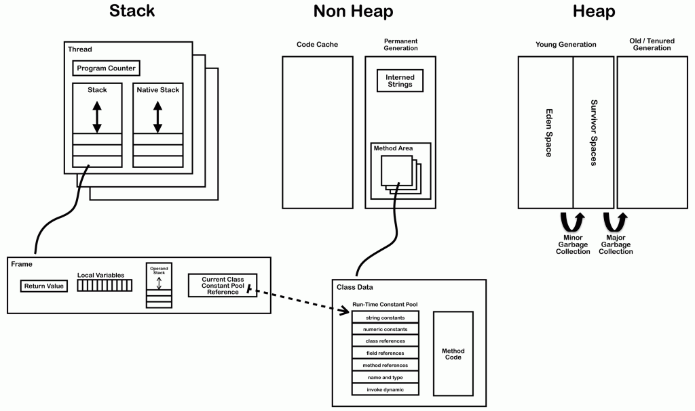
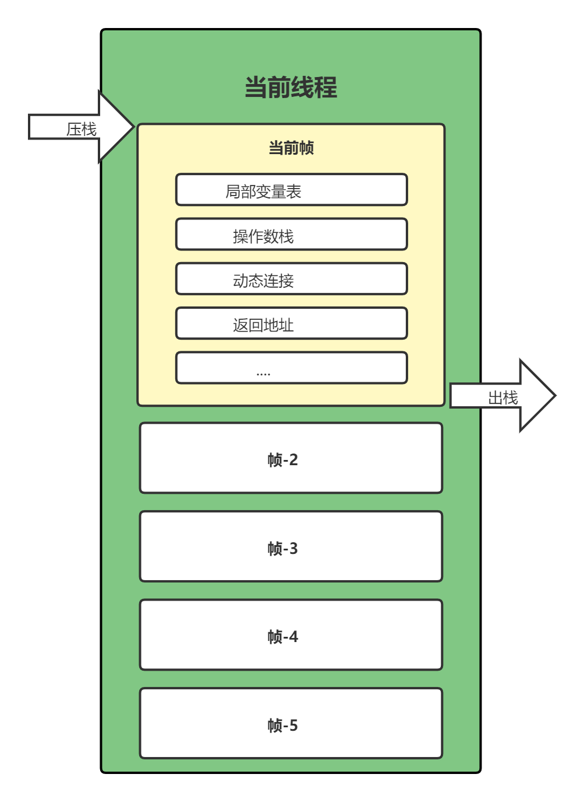

## 前言
一篇关于 JVM 的阅读笔记。
<!--more-->

## 1. 程序计数器（PC, Program Counter Register）

> 程序计数器是一块较小的内存空间，它的作用可以看作是当前线程所执行的字节码的行号治时期。在虚拟机的概念模型里字节码解释器工作室就是通过改变这个计数器的值来选取下一条执行的字节码指令，分支、循环、跳转、异常处理、线程恢复等基础功能都需要依赖这个计数器来完成。

- 如果线程正在执行的是 Java 方法，则这个计数器记录的是正在执行的虚拟机字节码指令地址
- 如果正在执行的是 Native 方法，则这个计数器值为 undefined  | *注： Native 方法指的是使用 Java 调用非 Java 方法代码的接口*
- 程序计数器的内存区域是唯一的没有规定任何 `OutOfMemoryError` 的 Java 虚拟机规范中的区域

## 2. JVM 栈（Stack, Java Virtual Machine Stacks）

JVM 栈也被称为虚拟机栈，每个方法在执行的同时都会创建一个帧栈，JVM 栈只对栈帧进行储存，入栈和出栈操作，每一个方法从调用直至执行完成的过程，就对应这一个栈帧在虚拟机栈中入栈到出栈的过程。栈内存的大小可以有两种设置，固定值和根据线程需要动态增长。在 JVM 栈这个数据区可能会抛出两种错误：

- `StackOverflowError` 出现在占内存设置成固定值的时候，当程序执行需要的占内存超过设定的固定值会抛出该错误
- `OutOfMemeoryError` 出现在占内存设置成动态增长的时候，当 JVM 尝试申请内存的大小超过了其可用内存时会抛出该错误

栈帧的内部存放着方法的局部变量表（Local Variables）、操作数栈（Operand Stack）、当前所属类常量池的引用（Reference to runtime constant pool）、方法返回地址（Return Address）等数据。一个栈帧随着一个方法的调用开始而创建，这个方法调用完成而销毁。

1. **局部变量表（也可以成为局部变量数据组或者本地变量表）**
   - 主要用于储存方法参数和定义在方法体内的局部变量，包括基本数据类型、对象引用，以及 returnAddress 类型。
   - 局部变量表建立在线程中的栈上，是线程的私有数据，也就不存在数据安全问题。
   - 在 Java 程序编译为 Class 文件时，就在方法的 Code 属性的 max_locals 数据项中确定了该方法所需要分配的局部变量表的最大容量。
   - 一般来说，如果函数参数和局部变量比较多，会使局部变量表膨胀，每一次调用会占用更多的栈空间，导致其嵌套调用次数就会减少。
   - 局部变量表的容量以变量槽（Variable Slot）为最小单位，每个变量槽都可以储存 32 位长度的内存空间，对于 64 长度的数据类型（例如 long , double）虚拟机为其分配两个连续的 Slot 空间，也就是相当于将一个 64 位长度的数据分割为两次 32 位读写。
2. **操作数栈**
   - 于局部变量表一样，均以字长为单位的数组。
   - 在执行字节码指令是会被用到，可以理解为 Java 虚拟机栈中的一个用于计算的临时数据储存区。
3. **动态链接**
   - 在 JVM 中，被调用的方法无法在编译期确定下来，只能够在运行期将调用方法的符号引用转换为直接引用，这种转换过程就被称为动态链接。
   - 每个栈帧中包含一个在常量池中对当前方法的引用，目的是支持方法调用过程的动态链接。
4. **方法返回地址**
   - 当一个方法开始执行后，只有两种方式可以退出这个方法。第一种方式是方法正常退出，第二种为异常退出。无论何种退出情况，都将返回至方法当前被调用的位置。方法退出的过程相当于弹出当前栈帧，退出可能有三种方式：
     - 返回值压入上层调用栈帧。
     - 异常信息抛给能够处理的栈帧。
     - PC指向方法调用后的下一条指令。

## 3. 本地方法栈（Native Method Stack）

本地方法栈（Native Method Stack）与虚拟机栈所发挥的作用是非常相似的，它们之间的区别不过是虚拟机栈为虚拟机执行 Java 方法（也就是字节码）服务，而本地方法栈则为虚拟机使用到的 Native 方法服务。Sun HotSpot 虚拟机直接就把本地方法栈和虚拟机栈合二为一。与虚拟机栈一样，本地方法栈区域也会抛出 StackOverflowError 和 OutOfMemoryError 异常。

线程开始调用本地方法时，会进入 个不再受 JVM 约束的世界。本地方法可以通过 JNI(Java Native Interface)来访问虚拟机运行时的数据区，甚至可以调用寄存器，具有和 JVM 相同的能力和权限。 当大量本地方法出现时，势必会削弱 JVM 对系统的控制力，因为它的出错信息都比较黑盒。对内存不足的情况，本地方法栈还是会抛出 nativeheapOutOfMemory。

JNI 类本地方法最著名的应该是 `System.currentTimeMillis()` ，JNI使 Java 深度使用操作系统的特性功能，复用非 Java 代码。 但是在项目过程中， 如果大量使用其他语言来实现 JNI , 就会丧失跨平台特性。

## 4. 堆

对于大多数应用来说，Java 堆（Java Heap）是 Java 虚拟机所管理的内存中最大的一块。Java 堆是被所有线程共享的一块内存区域，在虚拟机启动时创建。此内存区域的唯一目的就是存放对象实例，几乎所有的对象实例都在这里分配内存。

堆是垃圾收集器管理的主要区域，因此很多时候也被称做“GC堆”（Garbage Collected Heap）。从内存回收的角度来看，由于现在收集器基本都采用分代收集算法，所以 Java 堆中还可以细分为：新生代和老年代；再细致一点的有 Eden 空间、From Survivor 空间、To Survivor 空间等。从内存分配的角度来看，线程共享的 Java 堆中可能划分出多个线程私有的分配缓冲区（Thread Local Allocation Buffer,TLAB）。

Java 堆可以处于物理上不连续的内存空间中，只要逻辑上是连续的即可，当前主流的虚拟机都是按照可扩展来实现的（通过 -Xmx 和 -Xms 控制）。如果在堆中没有内存完成实例分配，并且堆也无法再扩展时，将会抛出 OutOfMemoryError 异常。

## 5. 方法区

方法区（Method Area）与 Java 堆一样，是各个线程共享的内存区域，它用于存储已被虚拟机加载的类信息、常量、静态变量、即时编译器编译后的代码等数据。虽然Java 虚拟机规范把方法区描述为堆的一个逻辑部分，但是它却有一个别名叫做 Non-Heap（非堆），目的应该是与 Java 堆区分开来。

Java 虚拟机规范对方法区的限制非常宽松，除了和 Java 堆一样不需要连续的内存和可以选择固定大小或者可扩展外，还可以选择不实现垃圾收集。垃圾收集行为在这个区域是比较少出现的，其内存回收目标主要是针对常量池的回收和对类型的卸载。当方法区无法满足内存分配需求时，将抛出 OutOfMemoryError 异常。
