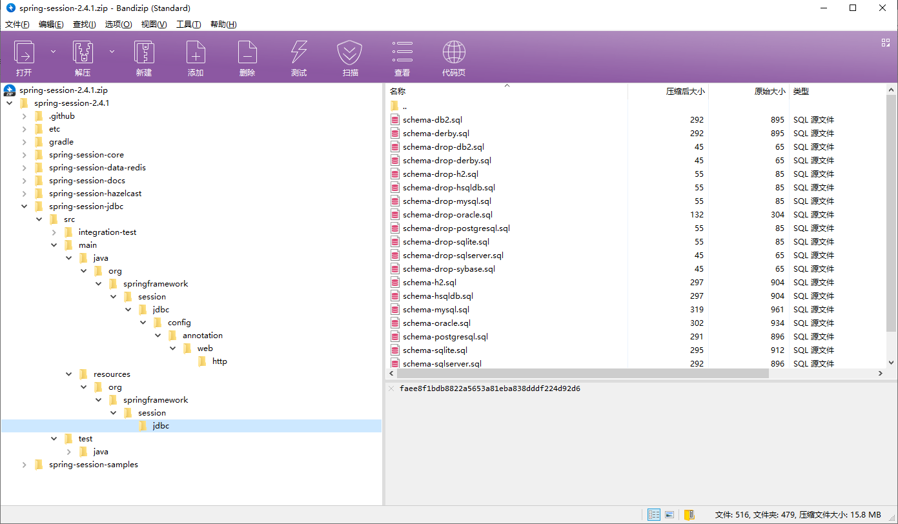
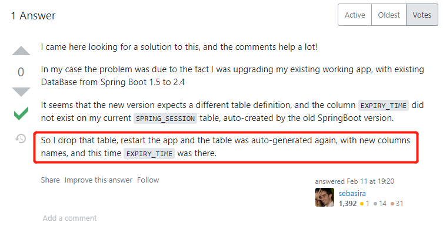

## 前言
想把公司的屎山从 Spring Boot 1.5.1 更新到 2.4.1，遇到了关于 Spring Session 的奇奇怪怪的问题，经过排查之后发现是不同的 Spring Session 版本生成的数据表不一致而导致的。
<!--more-->
## 关于 Spring Session JDBC
> **Spring** **Session** **JDBC** provides SessionRepository implementation backed by a relational database and configuration support.

“Spring Session JDBC 提供了由关系数据库和配置支持支持的 SessionRepository 实现”。以上是 Spring 官方对 Spring Session 的描述。Session 作为储存用户状态的一个容器，在集群部署的状态下是不起作用的，于是出现了 Spring Session ，它使用数据库将 Session 储存起来解决了这个问题。它有三个子项目，分别是

- Spring Session Data Redis
- Spring Session JDBC
- Spring Session Hazelcast 

公司老项目使用的就是 Spring Session JDBC。


以版本<font color="brown"> **2.4.1** </font>为例，我们可以在源文件的下找到存放着对应各个数据库的 sql 文件。在默认配置下，项目启动时会去数据库中创建`spring_session`和`spring_session_attributes`两张表格。

<center></center>

其中 MySQL 的建表语句如下：

``` sql
CREATE TABLE SPRING_SESSION (
	PRIMARY_ID CHAR(36) NOT NULL,
	SESSION_ID CHAR(36) NOT NULL,
	CREATION_TIME BIGINT NOT NULL,
	LAST_ACCESS_TIME BIGINT NOT NULL,
	MAX_INACTIVE_INTERVAL INT NOT NULL,
	EXPIRY_TIME BIGINT NOT NULL,
	PRINCIPAL_NAME VARCHAR(100),
	CONSTRAINT SPRING_SESSION_PK PRIMARY KEY (PRIMARY_ID)
) ENGINE=InnoDB ROW_FORMAT=DYNAMIC;

CREATE UNIQUE INDEX SPRING_SESSION_IX1 ON SPRING_SESSION (SESSION_ID);
CREATE INDEX SPRING_SESSION_IX2 ON SPRING_SESSION (EXPIRY_TIME);
CREATE INDEX SPRING_SESSION_IX3 ON SPRING_SESSION (PRINCIPAL_NAME);

CREATE TABLE SPRING_SESSION_ATTRIBUTES (
	SESSION_PRIMARY_ID CHAR(36) NOT NULL,
	ATTRIBUTE_NAME VARCHAR(200) NOT NULL,
	ATTRIBUTE_BYTES BLOB NOT NULL,
	CONSTRAINT SPRING_SESSION_ATTRIBUTES_PK PRIMARY KEY (SESSION_PRIMARY_ID, ATTRIBUTE_NAME),
	CONSTRAINT SPRING_SESSION_ATTRIBUTES_FK FOREIGN KEY (SESSION_PRIMARY_ID) REFERENCES SPRING_SESSION(PRIMARY_ID) ON DELETE CASCADE
) ENGINE=InnoDB ROW_FORMAT=DYNAMIC;

```

## 项目升级时出现的问题以及解决办法
公司的老项目使用的是 Spring Boot 1.5.1.RELEASE，为 2017 年发布的版本，因为太过老旧，我想将它升级到 2.4.1，由于升级前不了解 Spring Session JDBC 的工作方式，升级后访问项目开始疯狂报错，例如

- `PreparedStatementCallback; bad SQL grammar [INSERT INTO SPRING_SESSION(PRIMARY_ID, SESSION_ID, CREATION_TIME, LAST_ACCESS_TIME, MAX_INACTIVE_INTERVAL, EXPIRY_TIME, PRINCIPAL_NAME) VALUES (?, ?, ?, ?, ?, ?, ?)]; nested exception is *java.sql.SQLSyntaxErrorException*: Unknown column 'PRIMARY_ID' in 'field list' `

- `PreparedStatementCallback; bad SQL grammar [DELETE FROM SPRING_SESSION WHERE EXPIRY_TIME < ?]; nested exception is *java.sql.SQLSyntaxErrorException*: Unknown column 'EXPIRY_TIME' in 'where clause'`

- `PreparedStatementCallback; bad SQL grammar [INSERT INTO SPRING_SESSION(PRIMARY_ID, SESSION_ID, CREATION_TIME, LAST_ACCESS_TIME, MAX_INACTIVE_INTERVAL, EXPIRY_TIME, PRINCIPAL_NAME) VALUES (?, ?, ?, ?, ?, ?, ?)]; nested exception is *java.sql.SQLSyntaxErrorException*: Table 'xxx.spring_session' doesn't exist `

随后不得不将费尽心思升级的版本又回退了回去。后来到网上各种查阅，终于在 Stack Overflow 论坛中看到一则帖子，和我遇到的问题几乎一模一样，同样是将 Spring Boot 从 1.5 升级至 2.4 ，同样也遇到了 Spring Session JDBC 的问题，他的解决办法是将两个自动生成的表格删除。

<center></center>

于是去 Git Hub 上查看了 Spring Session 的源码，发现在 1.5.1.RELEASE 版本中的建表语句如下

``` sql
CREATE TABLE SPRING_SESSION (
	SESSION_ID CHAR(36) NOT NULL,
	CREATION_TIME BIGINT NOT NULL,
	LAST_ACCESS_TIME BIGINT NOT NULL,
	MAX_INACTIVE_INTERVAL INT NOT NULL,
	PRINCIPAL_NAME VARCHAR(100),
	CONSTRAINT SPRING_SESSION_PK PRIMARY KEY (SESSION_ID)
) ENGINE=InnoDB;

CREATE INDEX SPRING_SESSION_IX1 ON SPRING_SESSION (LAST_ACCESS_TIME);

CREATE TABLE SPRING_SESSION_ATTRIBUTES (
	SESSION_ID CHAR(36) NOT NULL,
	ATTRIBUTE_NAME VARCHAR(200) NOT NULL,
	ATTRIBUTE_BYTES BLOB NOT NULL,
	CONSTRAINT SPRING_SESSION_ATTRIBUTES_PK PRIMARY KEY (SESSION_ID, ATTRIBUTE_NAME),
	CONSTRAINT SPRING_SESSION_ATTRIBUTES_FK FOREIGN KEY (SESSION_ID) REFERENCES SPRING_SESSION(SESSION_ID) ON DELETE CASCADE
) ENGINE=InnoDB;

CREATE INDEX SPRING_SESSION_ATTRIBUTES_IX1 ON SPRING_SESSION_ATTRIBUTES (SESSION_ID);

```

于是问题就很明显了：因为两个版本的建表语句完全不同，在更新之后 Spring Session JDBC 自动执行的查询语句就会报错。需要将线上数据库中的表也删除后（最好进行备份），再启动项目，让新版数据表自动生成才能解决问题。
