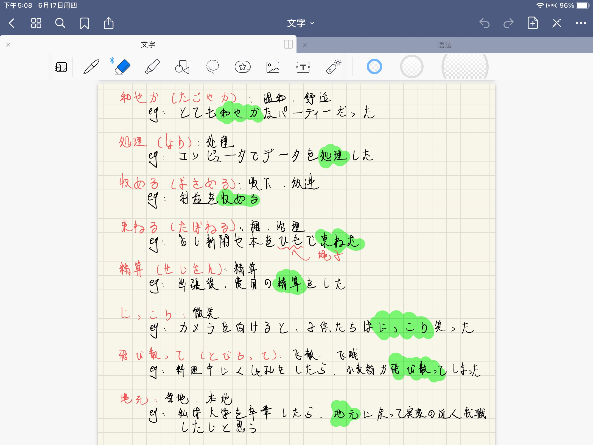

## 前言
618期间心血来潮买了一台iPad8，它也成为了我为数不多购买的数码产品之一，也尝试把它打造成一个生产力工具。
<!--more-->
## 笔记

有记笔记的需求因为报名了日语等级考试，而我的日语知识储`备来源仅仅只有大学期间那寥寥数月的新标日培训，着实是惨不忍睹。

在朋友的建议下买了一些真题和书籍，日常学习之余，可以把总结的重点难点记录在iPad里。笔记的存在可能可以使我在各种杂乱的工作中不偏离学习路线，有机会的话还可以临时抱下佛脚，短暂地巩固一下词汇量和语法。

关于笔和笔记工具选择，面对Apple Pencil的高价，还是转头选择了第三方的平替笔，毕竟只是用来写字而已，六七百的价格对于我来说还是有些奢侈了。而笔记工具则是因为听说Notebility貌似有一些同步失效的问题，便选择了Good Notes。

到目前为止大概使用了一个多星期，给我感受最明显的一点是————我该练字了。

<center></center>

在玻璃板上写字的体验可不比笔记本，在没有摩擦力的情况下一不留神就容易把字写歪。苦恼之际，突然发现好像有一种可以模仿纸张触感的“类纸膜”，遂花40元购之。

不知是这个价格买不到高质量的贴膜，还是我陷入了网购平台的陷阱，总之这张膜贴上之后的效果不尽如人意，美其名曰“模仿纸张触感”，感觉其实只是做了普通的磨砂效果，且透光性非常差。硬着头皮坚持用了2天之后，还是把它撕下来扔进了垃圾桶。

## 博客

博客框架使用的是[Hexo](https://github.com/hexojs/hexo)。如果要在iPad上实现博客发布的话，首先需要连接上服务器，一开始我使用的是[Termius](https://apps.apple.com/gb/app/termius-ssh-client/id549039908)工具。

值得一提的是，当服务器不允许用户远程密码登陆时，在iPad上使用密钥登录稍微有些麻烦。我的密钥存放于onedirve中，在第一次登录时需要将密钥下载并保存至Termius指定的目录才能被识别，手动复制粘贴密钥则更加麻烦，iPad的系统不支持直接读取`.pem`类型的文件，必须先在另外一台电脑将字符串形式的密钥发送至平板，之后在平板上复制粘贴至SSH工具的输入框内登陆。

而关于文章的上传方式，一开始的想法是使用Markdown工具编写完成后通过Termius上传至服务器，可惜的是开启Termius的SFTP与其他功能需要付费，大概是300+人名币一年。想了想我还是不pay，开始寻找其他的解决方案。

其实在购买iPad之前，服务器上的[code-server](https://github.com/cdr/code-server)已经在搭建过程中了。正如作者介绍的一样——Vs Code in the browser，它是可以让你在浏览器中使用[Vs Code](https://code.visualstudio.com/)的服务。

当初搭建这个的目的也是为了在iPad上也能进行编码工作，客户端使用[servediter](https://servediter.app/)即可接入code-server服务。于是现在不再需要上传文件至服务器，直接启动code-server服务，用浏览器或者servediter进行连接，打开博客项目文件进行编辑就可以了，并且在servediter中，连接自己的code-server服务是免费的。

文章的编写的问题解决了，接下来是发布。虽然Hexo是可以通过npm命令启动的，但因为据说效率比较低，所以还是决定将生成的静态文件放入[Nginx](https://www.nginx.com/)中，由Nginx启动，顺便再做一些其他的转发配置。于是我编写了一个简单的脚本，执行了Hexo项目构建-推送文件至Nginx的工作。

``` bash
#!/bin/bash

# 博客目录
g_path="XXX/blog"

# nginx目录
n_path="/usr/share/nginx"

cd $g_path

echo ">>>>> 准备生成静态文件"

hexo clean
hexo d

echo ">>>>> 推送静态文件至nginx目录"

# 复制并强制覆盖
\cp -r $g_path/public/* $n_path/html
```

这样，从博客的编写到发布，全部都可以在code-server中——也就是iPad上独立完成了。

*（关于整个博客的搭建过程，会挑时间整理出一篇文章详述，包括code-server与Hexo的搭建。）*

## 所以，它真的有生产力嘛？

> 你的下一台电脑，又何必是电脑？

对于2021款iPad Pro来说，它确实配的上这个广告词。12.9英寸的视网膜屏搭配M1芯片，最高支持2TB的硬盘容量，办公、作图、视频剪辑都不在话下，搭配上妙控键盘和Apple Pencil二代使用，绝对配得上“生产力工具”这个名词。

就是怎么说呢，顶配的价格还是贵了些。我手上的iPad8，618活动期间售价仅为2999。

人们经常拿surface go2与iPad8进行比较。我在使用iPad编程过程中遇到问题的时候也会抱怨：如果是surface就好了。除了IOS开发，大多数程序员还是习惯在windows上工作。

surface go二代，128G固态硬盘+8G运行内存的版本在618期间的售价是3888，乍一听还可以接受，直到我发现它的处理器是[英特尔® 奔腾® 金牌处理器 4425Y](https://ark.intel.com/content/www/cn/zh/ark/products/192786/intel-pentium-gold-processor-4425y-2m-cache-1-70-ghz.html)。微软在2020年发售的一款平板电脑搭配的竟然是奔腾处理器，实在是让人迷惑。

所以，最终我还是选择了iPad，因为便宜。那么它真的能作为生产力工具吗？我认为，iPad8作为学习的辅助设备，是非常不错的，大屏幕能让你更加专注，却又比笔记本便携，而从绘画创作的角度来说，iPad8配合Apple Pencil，有足够的支持能让你创作出好作品。

但如果你需要用它来帮助你进行代码的编写、运行和测试，又像我一样是个半桶水的菜鸟，那么想要把它变成一个说得过去的生产力工具需要花费一点时间和金钱，例如服务器和软件工具的购买，和搭建服务等。

不过好在我找到了最适合我的使用方法————记笔记对于我来说效果还不错，这篇博客也是在iPad上写的。总而言之通过各种各样的调试，这台iPad最后还是满足了需求，成为了我的生产力工具，那么这节标题的答案是肯定的。

其实“生产力”存在与否，除了工具的设计者以外，更多时候是使用者所决定的————iPad可以是一个大屏播放器，也可以是用来创作的画板，如果多花些心思，还能用来编辑和发布博客。而在学习、调试工具，让它具有生产力的这个过程中，相信你也能收获不少。
